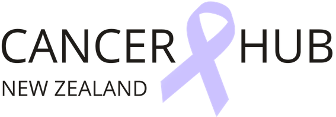
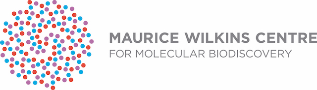

The [Maurice Wilkins Centre for Molecular Biodiscovery](http://www.mauricewilkinscentre.org/) (MWC) is a New Zealand Centre of Research Excellence (CoRE) targeting serious human disease. In particular, the MWC focuses on cancer, metabolic disease and diabetes, and infectious disease. In 2018 and 2019 the MWC funded the complete transcriptomic and exome analysis of the New Zealand melanoma cell line (NZM) cell line panel, comprising approximately 100 cell lines from NZ melanoma patients.

[CancerHub](https://cancerhub.net/) New Zealand provides e-cancer resources to a network of health professionals in New Zealand engaged in cancer research. One of the goals of CancerHub is to provide powerful online resources for collaboration. CancerHub is currently administered by the [Eccles Lab](https://www.otago.ac.nz/dsm-pathology/research/otago114692.html) research team, Department of Pathology, Otago Medical School - Dunedin Campus, University of Otago, Dunedin, NZ.

 
 
